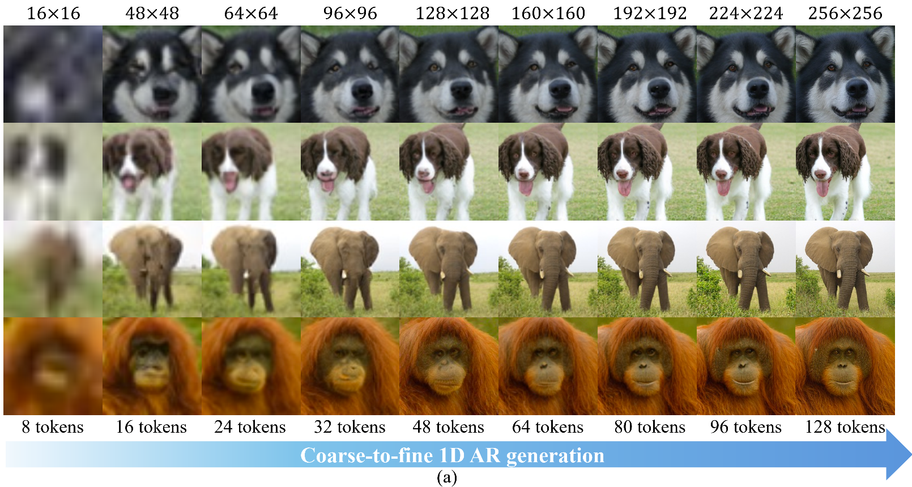
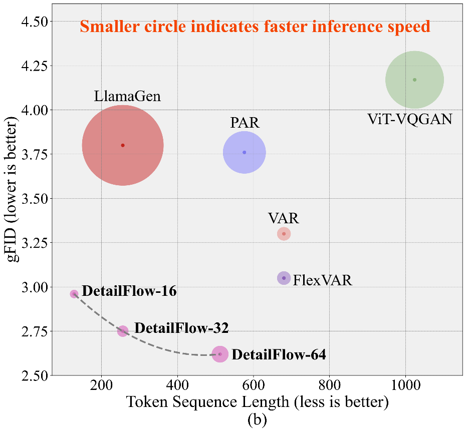

# DetailFlow🚀: 1D Coarse-to-Fine Autoregressive Image Generation via Next-Detail Prediction

&nbsp;
&nbsp;

 

## 🌿 Introduction

We present DetailFlow, a coarse-to-fine 1D autoregressive (AR) image generation method that models images through a novel next-detail prediction strategy. By learning a resolution-aware token sequence supervised with progressively degraded images, DetailFlow enables the generation process to start from the global structure and incrementally refine details. 

DetailFlow encodes tokens with an inherent semantic ordering, where each subsequent token contributes additional high-resolution information.  On the ImageNet 256×256 benchmark, our method achieves 2.96 gFID with 128 tokens, outperforming VAR (3.3 FID) and FlexVAR (3.05 FID), which both require 680 tokens in their AR models. Moreover, due to the significantly reduced token count and parallel inference mechanism, our method runs nearly 2× faster inference speed compared to VAR and FlexVAR. 

## 📰 News

**2025.05.28**:  🎉🎉🎉 DetailFlow is released! 🎉🎉🎉  See our [paper](https://arxiv.org/abs/2505.21473) .

## 📑 Open-source Plan

- [ ] Release the checkpoint of tokenizer and AR model
- [ ] Release the training & inference code

## Acknowledgement

We thank the great work from [SoftVQ-VAE](https://github.com/Hhhhhhao/continuous_tokenizer/tree/main), [LlamaGen](https://github.com/FoundationVision/LlamaGen) and [PAR](https://github.com/YuqingWang1029/PAR/tree/main).

## 🔥 Open positions
We are hiring interns and full-time researchers at the ByteFlow Group, ByteDance, with a focus on multimodal understanding and generation (preferred base: Hangzhou, Beijing, and Shenzhen). If you are interested, please contact yolomemos@gmail.com.